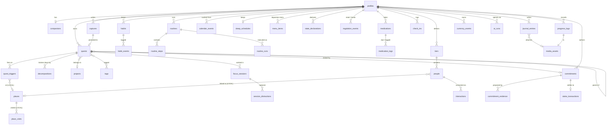

# Rudder — Data Model & ERD

**Version 2.0** · rewritten 2026-07-29 against constitution v2.0.0 and `docs/01-prd.md` v2.0.
Supersedes the four-pillar v1.0 model.

Three rules shape every decision below, and each is a constitutional requirement rather than a
preference:

1. **Counters are event logs, never mutable integers.** Offline-first plus last-writer-wins corrupts
   a mutable counter. Summing an append-only log is conflict-free (Principle VI).
2. **Derived values are computed, never stored.** Load, drift, adherence, calibration, streaks
   (Principle IX).
3. **Precise location never leaves the device.** The server never receives a coordinate
   (Principle XII).

---

## 1. Conventions

Applied to every user-owned, synced table:

```sql
--   id           uuid primary key (client-generated uuidv7)
--   user_id      uuid not null references auth.users on delete cascade
--   created_at   timestamptz not null default now()
--   updated_at   timestamptz not null default now()   ← trigger-maintained
--   deleted_at   timestamptz                          ← soft delete tombstone
--   rev          bigint not null default nextval('global_rev')  ← sync cursor

create sequence if not exists global_rev;

create or replace function touch_row() returns trigger as $$
begin
  new.updated_at := now();
  new.rev        := nextval('global_rev');
  return new;
end $$ language plpgsql;
```

**Sync classes.** Every table carries one:

| Class | Meaning | Examples |
|---|---|---|
| `SYNCED` | Full row replicates to Postgres | `quests`, `habits`, `people` |
| `LOCAL` | **Never leaves the device.** No Postgres table exists | `places`, `place_visits`, `outbox` |
| `PARTIAL` | Row syncs with sensitive columns stripped client-side | `quest_triggers` (place_id syncs, geometry does not) |
| `DERIVED` | Not a table. Computed at read time | load, drift, streaks, adherence |

---

## 2. ERD



---

## 3. Key modelling decisions

| Decision | Rationale |
|---|---|
| **`places` is `LOCAL`. No Postgres table exists.** | Principle XII. Coordinates cannot leak from a table that was never created. `quest_triggers.place_id` syncs as an opaque uuid; the geometry resolving it lives only in device SQLite. On a new device, place-bound quests arrive intact but dormant until the user re-anchors them. That is the correct trade — a dormant quest is recoverable, a leaked home address is not |
| **`place_visits` is `LOCAL` and capped** | Movement history is the highest-sensitivity data in the product. It is never synced, never backed up, and rolls off after 90 days by a local job |
| **`captures` stays separate from `quests`** | Capture must succeed with zero structure. A capture is a raw event; a quest is a structured commitment. Promotion is explicit and reversible. Captures are append-only and never merged (Principle I) |
| **Subtasks are `quests` with `parent_id`** | A decomposed step must be completable, deferrable, and estimable exactly like a top-level quest |
| **`quest_triggers` is a child table, not columns** | A quest can carry a time trigger *and* several place triggers of different kinds. Flattening them into columns makes "remind me when I leave work OR pass the pharmacy" unrepresentable |
| **`defer_count` is first-class** | Drives `avoidance_penalty` (FR-2.7). Deferred 5× means *offer decomposition*, not nag harder. It is a routing signal and MUST NOT be displayed as a count |
| **`habits` use cadence, not daily-binary** | `target_count` per `period` makes a miss arithmetic rather than a break. There is no `streak` column anywhere — streaks are DERIVED, so no write path can corrupt one and no query can total them |
| **`medication_logs` pre-created per due occurrence** | Distinguishes `missed` from "no data" — adherence is meaningless without a denominator. The denominator exists for the prescriber export (FR-7.6) and is never surfaced on a home screen |
| **`state_declarations` is an interval log** | Overstimulation is a state with a start and an end, not a flag. Historical intervals feed allostatic load |
| **Allostatic load has no table** | DERIVED, recomputed on read from sleep debt, missed breaks, declaration intervals, Bonds intensity, and completion velocity. Storing it would create a sync conflict on the single most safety-critical value in the product (Principle IX, FR-4.5) |
| **`interactions` is append-only** | `last_contact` and `drift` are DERIVED from it. A mutable `last_contacted_at` would be lost to LWW on a two-device edit, silently resetting a relationship's drift |
| **`people` and `tiers` are `SYNCED` but never joined across users** | Third-party personal data. RLS-isolated, never sent to an SDK, and there is no table that could express a cross-user edge (constitution, Security §) |
| **`currency_events` is append-only** | Same reasoning as XP in v1.0. Balance is a sum |
| **Stakes tables ship in the P2 migration, not v1** | FR-8.x is P2 and depends on FR-4.5 for guardrail 8. Creating the tables early invites building against them |
| **`commitment_evidence` is separate from `commitments`** | Evidence *proposes*; it never resolves. The separation makes FR-8.4 structural: nothing writes `commitments.outcome` except an explicit user action |
| **`ai_runs` ledger** | Enforces NFR-14's per-user daily cap and makes unit economics visible from day one |

### Tables that deliberately do not exist

Their absence is the enforcement mechanism. Adding any of them is a constitutional violation, and
review should treat a migration that creates one as a blocker.

| Absent table | Why |
|---|---|
| `streaks`, `streak_counters` | Streaks are DERIVED. A stored streak can be broken by a write; a computed one cannot (Principle IV) |
| `failure_counts`, `missed_totals`, `adherence_scores` | No aggregated failure figure may exist anywhere in the product (Principle IV, X.9) |
| `companion_mood`, `companion_health` | Companion state is a pure function of cumulative contribution. A mutable mood column is how a pet app becomes a punishment mechanic (Principle IV, XI) |
| `user_locations`, `location_history` (server) | Principle XII. Server-side location storage is prohibited outright |
| `social_edges`, `friendships`, `contact_graph` | No cross-user social graph may be constructed from contact data (Security §) |
| `wallets`, `tokens`, `balances_usd`, `community_pot` | The app holds, pools, escrows, and redistributes nothing. FR-8.10/8.11 (Security §, Money) |
| `stake_totals`, `forfeit_history_summary` | Individual transactions only; nothing aggregated (Principle X.9) |

---

## 4. Core DDL

Full migrations live in `supabase/migrations/`. Abbreviated below, showing the pattern and the
tables that changed or are new in v2.0.

```sql
-- ─── profiles ─────────────────────────────────────────────────────────────
create table profiles (
  id                  uuid primary key references auth.users on delete cascade,
  display_name        text,
  timezone            text not null default 'UTC',
  onboarded_at        timestamptz,
  last_active_at      timestamptz,        -- drives re-entry flow (FR-0.8)
  notification_cap    smallint not null default 6 check (notification_cap between 0 and 12),
  ai_enabled          boolean not null default true,
  low_stim            boolean not null default false,
  personality_enabled boolean not null default true,   -- FR-1.5
  created_at          timestamptz not null default now(),
  updated_at          timestamptz not null default now(),
  rev                 bigint not null default nextval('global_rev')
);
-- NOTE: no calibration_factor column. DERIVED from quests.estimate vs actual (Principle IX).

-- ─── companions ───────────────────────────────────────────────────────────
create table companions (
  id            uuid primary key,
  user_id       uuid not null references auth.users on delete cascade,
  name          text not null,
  species       text not null,
  -- Growth is a pure function of cumulative contribution, recomputed from
  -- currency_events. There is deliberately no mood, health, or last_fed column.
  created_at    timestamptz not null default now(),
  updated_at    timestamptz not null default now(),
  deleted_at    timestamptz,
  rev           bigint not null default nextval('global_rev')
);

-- ─── quests ───────────────────────────────────────────────────────────────
create table quests (
  id                uuid primary key,
  user_id           uuid not null references auth.users on delete cascade,
  parent_id         uuid references quests on delete cascade,
  capture_id        uuid references captures,
  project_id        uuid references projects on delete set null,
  title             text not null,
  notes             text,
  system            text not null default 'quest'
                      check (system in ('quest','rhythm','regulation','bond','solitude')),
  status            text not null default 'open'
                      check (status in ('open','done','dropped')),
  estimate_minutes  int check (estimate_minutes > 0),
  actual_minutes    int check (actual_minutes  > 0),
  energy_required   text check (energy_required in ('low','medium','high')),
  scheduled_for     timestamptz,
  due_at            timestamptz,
  defer_count       int not null default 0,   -- routing signal, never displayed
  completed_at      timestamptz,
  narrative_title   text,                     -- FR-2.10, cosmetic only
  difficulty_band   smallint check (difficulty_band between 1 and 5),
  created_at        timestamptz not null default now(),
  updated_at        timestamptz not null default now(),
  deleted_at        timestamptz,
  rev               bigint not null default nextval('global_rev')
);
create index on quests (user_id, status) where deleted_at is null;
create index on quests (user_id, parent_id);

-- ─── quest_triggers ───────────────────────────────────────────  PARTIAL ───
create table quest_triggers (
  id            uuid primary key,
  user_id       uuid not null references auth.users on delete cascade,
  quest_id      uuid not null references quests on delete cascade,
  kind          text not null
                  check (kind in ('time','arrive','leave','pass_near','while_out')),
  fire_at       timestamptz,               -- kind='time'
  place_id      uuid,                      -- opaque; resolves ONLY in device SQLite
  radius_m      int default 250 check (radius_m between 50 and 5000),
  active        boolean not null default true,
  last_fired_at timestamptz,
  created_at    timestamptz not null default now(),
  updated_at    timestamptz not null default now(),
  deleted_at    timestamptz,
  rev           bigint not null default nextval('global_rev')
);
-- place_id syncs as an opaque uuid. No latitude, longitude, geometry, or address
-- column exists on this table or any other server-side table. Principle XII.

-- ─── habits ───────────────────────────────────────────────────────────────
create table habits (
  id            uuid primary key,
  user_id       uuid not null references auth.users on delete cascade,
  title         text not null,
  target_count  smallint not null default 1 check (target_count > 0),
  period        text not null default 'week' check (period in ('day','week','month')),
  active        boolean not null default true,
  created_at    timestamptz not null default now(),
  updated_at    timestamptz not null default now(),
  deleted_at    timestamptz,
  rev           bigint not null default nextval('global_rev')
);
-- No streak column. No last_completed column. Both DERIVED from habit_events.

create table habit_events (           -- append-only
  id          uuid primary key,
  user_id     uuid not null references auth.users on delete cascade,
  habit_id    uuid not null references habits on delete cascade,
  occurred_at timestamptz not null default now(),
  created_at  timestamptz not null default now(),
  rev         bigint not null default nextval('global_rev')
);

-- ─── state_declarations ───────────────────────────────────────────────────
create table state_declarations (
  id          uuid primary key,
  user_id     uuid not null references auth.users on delete cascade,
  state       text not null check (state in ('overstimulated','understimulated','wind_down')),
  started_at  timestamptz not null default now(),
  ended_at    timestamptz,
  created_at  timestamptz not null default now(),
  updated_at  timestamptz not null default now(),
  rev         bigint not null default nextval('global_rev')
);

-- ─── menu_items (dopamine menu) ───────────────────────────────────────────
create table menu_items (
  id              uuid primary key,
  user_id         uuid not null references auth.users on delete cascade,
  label           text not null,
  course          text not null
                    check (course in ('starter','main','side','dessert','special')),
  effort          text not null default 'low' check (effort in ('low','medium','high')),
  typical_minutes int,
  needs_place     boolean not null default false,
  needs_kit       boolean not null default false,
  created_at      timestamptz not null default now(),
  updated_at      timestamptz not null default now(),
  deleted_at      timestamptz,
  rev             bigint not null default nextval('global_rev')
);
-- 'dessert' is the user's own label for something they can overdo.
-- The app never reclassifies an item and never scores one as unhealthy.

-- ─── tiers & people (Bonds) ───────────────────────────────────────────────
create table tiers (
  id              uuid primary key,
  user_id         uuid not null references auth.users on delete cascade,
  label           text not null,                -- 'bff', 'rizz', 'myself', ...
  cadence_days    int not null check (cadence_days between 1 and 3650),
  sort_order      smallint not null default 0,
  created_at      timestamptz not null default now(),
  updated_at      timestamptz not null default now(),
  deleted_at      timestamptz,
  rev             bigint not null default nextval('global_rev')
);

create table people (
  id                   uuid primary key,
  user_id              uuid not null references auth.users on delete cascade,
  tier_id              uuid references tiers on delete set null,
  display_name         text not null,
  cadence_days_override int check (cadence_days_override between 1 and 3650),
  last_topic           text,                    -- so the user can open with it
  notes                text,
  place_id             uuid,                    -- opaque; resolves LOCAL only
  birthday             date,
  created_at           timestamptz not null default now(),
  updated_at           timestamptz not null default now(),
  deleted_at           timestamptz,
  rev                  bigint not null default nextval('global_rev')
);
-- No last_contacted_at. DERIVED from interactions, because a mutable timestamp
-- would be silently clobbered by LWW on a two-device edit.

create table interactions (           -- append-only
  id          uuid primary key,
  user_id     uuid not null references auth.users on delete cascade,
  person_id   uuid not null references people on delete cascade,
  kind        text not null check (kind in ('message','call','hangout','other')),
  occurred_at timestamptz not null default now(),
  note        text,
  created_at  timestamptz not null default now(),
  rev         bigint not null default nextval('global_rev')
);
-- 'hangout' is distinct from 'message': a text does not satisfy a hangout cadence.

-- ─── currency_events ──────────────────────────────────────────────────────
create table currency_events (        -- append-only; balance is a sum
  id          uuid primary key,
  user_id     uuid not null references auth.users on delete cascade,
  amount      int not null,           -- may be negative (a spend)
  reason      text not null check (reason in ('quest','focus','habit','reveal','spend')),
  ref_id      uuid,
  occurred_at timestamptz not null default now(),
  created_at  timestamptz not null default now(),
  rev         bigint not null default nextval('global_rev')
);
-- Soft currency only. No cash value, not purchasable, not convertible (Principle X).

-- ─── commitments (Stakes) ─────────────────────── P2 MIGRATION, NOT v1 ─────
create table commitments (
  id                uuid primary key,
  user_id           uuid not null references auth.users on delete cascade,
  quest_id          uuid not null references quests on delete cascade,
  amount_minor      int not null check (amount_minor > 0),
  currency          char(3) not null,
  destination_id    uuid not null references stake_destinations,
  due_at            timestamptz not null,
  authored_at       timestamptz not null default now(),
  state             text not null default 'live'
                      check (state in ('live','suspended','met','forfeited','unwound')),
  suspended_reason  text check (suspended_reason in ('load','absence','user')),
  created_at        timestamptz not null default now(),
  updated_at        timestamptz not null default now(),
  rev               bigint not null default nextval('global_rev'),

  -- FR-8.2: no stake inside a 2h window of its own deadline
  constraint lead_time check (due_at - authored_at >= interval '2 hours')
);

create table commitment_evidence (
  id            uuid primary key,
  user_id       uuid not null references auth.users on delete cascade,
  commitment_id uuid not null references commitments on delete cascade,
  source        text not null check (source in ('geofence','motion','photo','manual')),
  suggests      text not null check (suggests in ('met','not_met')),
  observed_at   timestamptz not null default now(),
  created_at    timestamptz not null default now(),
  rev           bigint not null default nextval('global_rev')
);
-- Evidence PROPOSES. It never resolves. Only an explicit user action writes
-- commitments.state to 'met' or 'forfeited'. FR-8.4 is structural, not procedural.
```

**Quest categories that are not stakeable** are enforced in the domain layer and asserted by a
constraint trigger: a `commitments` row referencing a quest whose `system` is `'rhythm'`,
`'regulation'`, or `'solitude'` is rejected (Principle X.4).

---

## 5. Row Level Security — the pattern

Every user-owned table, without exception:

```sql
alter table quests enable row level security;

create policy quests_select on quests for select
  using (user_id = auth.uid());
create policy quests_insert on quests for insert
  with check (user_id = auth.uid());
create policy quests_update on quests for update
  using (user_id = auth.uid()) with check (user_id = auth.uid());
create policy quests_delete on quests for delete
  using (user_id = auth.uid());
```

Default-deny: RLS enabled with no policy denies everything, which is the correct failure mode.
**NFR-19** requires a CI test asserting user B reads zero rows of user A across *every* table —
enumerated from `information_schema`, so a newly added table without policies fails the build rather
than shipping silently.

---

## 6. Derived values — computed, never stored

| Value | Computed from | Used by |
|---|---|---|
| Allostatic load | sleep debt, missed breaks, `state_declarations` intervals, Bonds intensity, completion velocity | scorer damping, stake auto-suspend |
| Drift (per person) | `now − max(interactions.occurred_at)` ÷ effective cadence | scorer `drift_pressure` |
| Streak | `habit_events` within cadence windows | display only, de-emphasised past 30d |
| Calibration factor | rolling median of `actual_minutes / estimate_minutes`, min 8 samples | automatic buffers, `time_fit` |
| Adherence % | `medication_logs` taken ÷ due | prescriber export only |
| Currency balance | `sum(currency_events.amount)` | companion growth, spends |
| Companion growth stage | cumulative positive `currency_events` | companion visual state |
| Day capacity | `calendar_events` + open quest estimates vs waking hours | day capacity bar |

None of these has a column. Every one of them would otherwise be corruptible by last-writer-wins.

---

## 7. Local SQLite deltas

Device schema mirrors Postgres, plus:

| Local-only table | Purpose |
|---|---|
| `places` | `id, label, lat, lon, radius_m, kind`. **The only place coordinates exist anywhere.** Excluded from iCloud backup |
| `place_visits` | Movement history for calibration and `place_fit`. 90-day rolling window, never synced |
| `geofence_registry` | The rolling active set of ≤20 OS-monitored regions (NFR-9), with scores and last re-evaluation |
| `outbox` | Pending mutations: `entity, entity_id, op, payload, attempts, created_at` |
| `sync_cursor` | Last `rev` successfully pulled |
| `bundled_content` | Resetters, solo-quest templates, curriculum, soundscapes. Read-only, ships with the binary |

Local deltas on synced tables: `dirty` flag, `local_only` flag for anonymous-mode rows created
before sign-in.

**Backup exclusion.** The SQLite file is marked `NSURLIsExcludedFromBackupKey`. PHI and coordinates
never reach iCloud (Principle XII, Security §, App Store Guideline 5.1.3).
