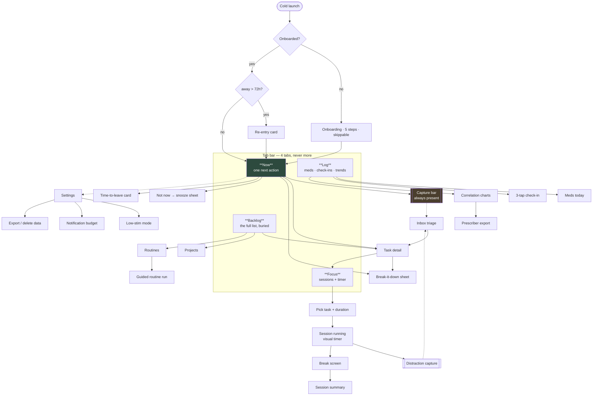

# Rudder — Screen Inventory, Navigation & Wireframes

---

## 1. Navigation map



**Four tabs, hard limit.** Every additional tab is a decision the user has to make on every launch.

## 2. Screen inventory

| # | Screen | Pillar | Priority | Notes |
|---|---|---|---|---|
| S-01 | Onboarding (5 steps) | — | P0 | Skippable throughout |
| S-02 | **Now** (home) | P1 | P0 | The single most important screen in the app |
| S-03 | Re-entry card | P1 | P0 | Replaces S-02 after 72h absence |
| S-04 | Capture bar / modal | P1 | P0 | Reachable from everywhere |
| S-05 | Inbox triage | P1 | P0 | Swipe-based, batch |
| S-06 | Task detail | P1 | P0 | |
| S-07 | Break-it-down sheet | P1 | P0 | The differentiator |
| S-08 | Snooze sheet | P1 | P0 | |
| S-09 | Backlog | P1 | P0 | Views: project / energy / quick wins / stuck |
| S-10 | Projects | P1 | P1 | |
| S-11 | Routines list + editor | P1 | P1 | |
| S-12 | Guided routine run | P1 | P1 | One step at a time |
| S-13 | Time-to-leave card | P2 | P0 | Appears on S-02 contextually |
| S-14 | Day capacity bar | P2 | P1 | Header of S-02 |
| S-15 | Visual timer (full screen) | P2 | P0 | |
| S-16 | Focus: pick task + duration | P3 | P0 | |
| S-17 | Session running | P3 | P0 | |
| S-18 | Break screen | P3 | P1 | |
| S-19 | Session summary | P3 | P0 | |
| S-20 | Body doubling lobby | P3 | P1 | Anonymous presence count |
| S-21 | Meds today | P4 | P0 | |
| S-22 | Medication editor | P4 | P0 | |
| S-23 | 3-tap check-in | P4 | P0 | |
| S-24 | Trends / correlation | P4 | P1 | Persistent disclaimer |
| S-25 | Prescriber export | P4 | P1 | |
| S-26 | Settings | — | P0 | |
| S-27 | Weekly review card | — | P1 | |

## 3. Wireframes

### S-02 · Now — the home screen

The whole product thesis is on this screen: one thing, time made visible, capture always reachable.

```
┌─────────────────────────────────────────────┐
│  Tuesday, 26 Jul            🔥 12   ⚙︎        │  ← streak is grey when paused, never red
├─────────────────────────────────────────────┤
│  ████████████████████░░░░░░░  7h 20m / 9h    │  ← S-14 day capacity. Fact, not warning.
├─────────────────────────────────────────────┤
│                                             │
│   ┌───────────────────────────────────────┐ │
│   │  ⏰  Leave in 22 min                   │ │  ← S-13, only when relevant
│   │      Dentist · 14:30 · 18 min drive   │ │
│   │                        [ Snooze  ]    │ │
│   └───────────────────────────────────────┘ │
│                                             │
│   NEXT                                      │
│   ┌───────────────────────────────────────┐ │
│   │                                       │ │
│   │   Email Sarah the Q3 numbers          │ │  ← ONE task. Large type.
│   │                                       │ │
│   │   ~15 min  ·  low energy  ·  @computer│ │
│   │   ⓘ You usually take ~26 min for this │ │  ← calibration, matter-of-fact
│   │      kind of thing                    │ │
│   │                                       │ │
│   │   ┌─────────────────┐  ┌────────────┐ │ │
│   │   │   ▶  Do it      │  │  Not now   │ │ │
│   │   └─────────────────┘  └────────────┘ │ │
│   │                                       │ │
│   │   ⑂ Break it down        ⟳ Shuffle    │ │
│   └───────────────────────────────────────┘ │
│                                             │
│   ┌ ─ ─ ─ ─ ─ ─ ─ ─ ─ ─ ─ ─ ─ ─ ─ ─ ─ ─ ┐ │
│     3 things in your inbox        Sort →   │  ← low contrast. Never a red badge.
│   └ ─ ─ ─ ─ ─ ─ ─ ─ ─ ─ ─ ─ ─ ─ ─ ─ ─ ─ ┘ │
│                                             │
├─────────────────────────────────────────────┤
│  ✎  What's on your mind?              🎤    │  ← S-04, always focused on tap
├─────────────────────────────────────────────┤
│   ●Now      ◷Focus     ♡Log      ☰Backlog   │
└─────────────────────────────────────────────┘
```

**Rules for this screen**
- Never more than one task visible.
- The inbox hint shows a *count*, never a list, and never turns red.
- If nothing qualifies, the empty state is "Nothing needs you right now." — not "0 tasks".
- On iPad landscape, this becomes a two-column split: Now on the left, Backlog preview on the
  right — but the right column is collapsible and collapsed by default.

### S-03 · Re-entry (replaces S-02 after 72h away)

```
┌─────────────────────────────────────────────┐
│                                             │
│                                             │
│         You've been away 9 days.            │
│                                             │
│         Nothing's overdue —                 │
│         I paused everything.                │
│                                             │
│    ┌─────────────────────────────────────┐  │
│    │  Water the plants                   │  │  ← deliberately trivial. Momentum > progress.
│    │  ~2 min                             │  │
│    │        ┌──────────────────────┐     │  │
│    │        │      ▶  Do it        │     │  │
│    │        └──────────────────────┘     │  │
│    └─────────────────────────────────────┘  │
│                                             │
│         Show me everything  →               │  ← escape hatch, low emphasis
│                                             │
└─────────────────────────────────────────────┘
```

No counts. No "42 overdue". This screen exists purely so the app survives a relapse.

### S-07 · Break it down

```
┌─────────────────────────────────────────────┐
│  ←              Break it down               │
├─────────────────────────────────────────────┤
│  Do my taxes                                │
│                                             │
│  ┌───────────────────────────────────────┐  │
│  │ 1  Open Files and search "W2"    3 min│  │  ← step 1 is ALWAYS <5min, no decisions
│  │ 2  Put every hit in one folder   5 min│  │
│  │ 3  Open TurboTax, click Start    2 min│  │
│  │ 4  Type in the W2 numbers       20 min│  │
│  │ 5  Save, don't submit yet        1 min│  │
│  └───────────────────────────────────────┘  │
│                                             │
│  ⟳ Try again        ✎ Edit steps            │
│                                             │
│  ┌───────────────────────────────────────┐  │
│  │        Add these 5 steps              │  │
│  └───────────────────────────────────────┘  │
│                                             │
│  ┌───────────────────────────────────────┐  │
│  │   ▶  Just start step 1 now            │  │  ← the real CTA. Bypasses the list entirely.
│  └───────────────────────────────────────┘  │
└─────────────────────────────────────────────┘
```

"Just start step 1 now" is the most important button in the app. Accepting a 5-step plan is still
planning; the goal is to be *doing something* within 4 seconds of opening this sheet.

### S-17 · Session running

```
┌─────────────────────────────────────────────┐
│  ✕                                    ♪ ▾   │  ← soundscape picker
│                                             │
│              ╭───────────────╮              │
│           ╭──╯               ╰──╮           │
│          │      ███████░░░       │          │  ← draining disc. This is the timer.
│          │                       │          │     Numeric readout is secondary.
│          │        18:42          │          │
│          │                       │          │
│           ╰──╮               ╭──╯           │
│              ╰───────────────╯              │
│                                             │
│         Email Sarah the Q3 numbers          │
│                                             │
│      ⏸ Pause          ✓ Done early          │
│                                             │
│  ┌ ─ ─ ─ ─ ─ ─ ─ ─ ─ ─ ─ ─ ─ ─ ─ ─ ─ ─ ┐   │
│   ✎ Thought? Park it here.                 │  ← FR-3.2 — does NOT end the session
│  └ ─ ─ ─ ─ ─ ─ ─ ─ ─ ─ ─ ─ ─ ─ ─ ─ ─ ─ ┘   │
│                                             │
│              2 parked this session          │
└─────────────────────────────────────────────┘
```

Mirrored as a Live Activity on the Lock Screen / Dynamic Island (v1.1) — same disc, same remaining
time, with a "park a thought" deep-link action.

### S-05 · Inbox triage

Swipe-based, one item at a time, batch-processed. Never a list to "get through".

```
┌─────────────────────────────────────────────┐
│  ←        Inbox          3 left             │
├─────────────────────────────────────────────┤
│                                             │
│    ┌───────────────────────────────────┐    │
│    │  "call the dentist about the      │    │
│    │   thing thursday"                 │    │
│    │                                   │    │
│    │  Rudder thinks:                   │    │
│    │  ▸ Task · ~5 min · low energy     │    │  ← every field pre-filled and tappable
│    │  ▸ Thursday 30 Jul                │    │
│    │  ▸ @phone                         │    │
│    └───────────────────────────────────┘    │
│                                             │
│    ← Bin        ↑ Someday        Keep →     │
│                                             │
│         ┌──────────────────────────┐        │
│         │   ✓  Looks right         │        │  ← one tap accepts everything
│         └──────────────────────────┘        │
└─────────────────────────────────────────────┘
```

### S-21 · Meds today  ·  S-23 · Check-in

```
┌──────────────────────────┐   ┌──────────────────────────┐
│  Today's meds            │   │   How's it going?        │
├──────────────────────────┤   ├──────────────────────────┤
│  ● 08:00  Vyvanse 40mg   │   │   Energy                 │
│           ✓ Taken 08:12  │   │   ○  ○  ●  ○  ○          │
│                          │   │                          │
│  ○ 13:00  Booster 10mg   │   │   Mood                   │
│    ┌──────┐ ┌──────────┐ │   │   ○  ○  ○  ●  ○          │
│    │ Took │ │ Skipped  │ │   │                          │
│    └──────┘ └──────────┘ │   │   Focus                  │
│                          │   │   ○  ●  ○  ○  ○          │
│  ─────────────────────── │   │                          │
│  This week      6/7 ✓    │   │   ✎ anything to add?     │
│                          │   │                          │
│  ⓘ A log, not medical    │   │   ┌──────────────────┐   │
│    advice. Talk to your  │   │   │      Done        │   │
│    prescriber.           │   │   └──────────────────┘   │
└──────────────────────────┘   └──────────────────────────┘
```

Med logging is available directly from the notification's action buttons — most days the user should
never open S-21 at all.

### S-24 · Trends

```
┌─────────────────────────────────────────────┐
│  ←   Trends            7d  [30d]  90d       │
├─────────────────────────────────────────────┤
│  Focus minutes                              │
│  ▁▃▅▂▇▆▁                                    │
│  Avg 84 min/day                             │
│                                             │
│  Focus on days meds were taken              │
│    taken   ████████████████  96 min         │
│    missed  ███████           41 min         │
│                                             │
│  Energy by time of day                      │
│    morning   ███░░  3.1                     │
│    afternoon ████░  4.0                     │
│    evening   ██░░░  2.2                     │
│                                             │
│  Your estimates                             │
│    You say 20 min → usually 34 min (1.7×)   │
│    Improving: was 2.3× in May               │
│                                             │
│ ╔═════════════════════════════════════════╗ │
│ ║ ⓘ This is a personal log, not medical   ║ │  ← persistent, never dismissible
│ ║   evidence. Correlation is not          ║ │
│ ║   causation. Discuss changes with your  ║ │
│ ║   prescriber.                           ║ │
│ ╚═════════════════════════════════════════╝ │
│                                             │
│         Export for my appointment  →        │
└─────────────────────────────────────────────┘
```

## 4. Design system tokens

| Token | Value | Reasoning |
|---|---|---|
| Base surface | Warm dark `#16181A` / warm light `#FBFAF8` | Pure black/white is high-stim; warm greys reduce glare |
| Accent | Single accent per theme. No secondary accent. | Multiple accents = multiple attention targets |
| Positive | Muted green `#4A8F6D` | Never neon |
| Attention | Amber `#C89A3C` | **There is no red in the UI**, except destructive confirm dialogs |
| Type scale | 34 / 22 / 17 / 15 / 13 | Big enough that the next action dominates |
| Font | SF Pro (system) | Free, familiar, ships with Dynamic Type support |
| Radius | 16 / 12 / 8 | |
| Motion | 180ms ease-out standard; **0ms** in low-stim | Everything must survive `Reduce Motion` |
| Touch target | 48×48 minimum | Motor variability is common with ADHD |
| Contrast | ≥ 4.5:1 body, ≥ 3:1 large | WCAG 2.2 AA (NFR-6) |

**The no-red rule is a product decision, not an aesthetic one.** Red is the colour of failure, and
failure signals are exactly what drives ADHD app abandonment. Overdue items are amber at worst.

## 5. Where to source real design references

Rather than inventing patterns, pull from shipped apps — see [05-toolchain.md](05-toolchain.md):
- **Mobbin MCP** — query for e.g. "timer screens from productivity apps", "onboarding flows with
  skippable steps", "empty states in habit trackers"
- **Figma MCP** (already connected in this environment) — build the component library and push
  screens into Figma from these wireframes
- **UI UX Pro Max skill** — generates the full token set + palette from the product brief
