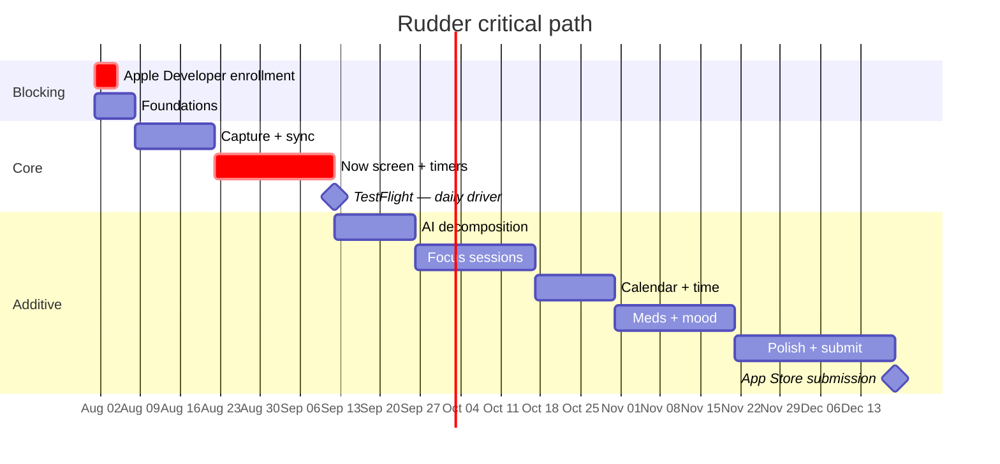

# Rudder — Build Roadmap

Sequenced so that a **usable app exists on your iPad by week 6**, and every phase after that is
additive. Estimates assume a solo dev working evenings/weekends with Claude Code, ~12–15 hrs/week.

---

## Phase 0 — Foundations (week 1)

| # | Task | Output |
|---|---|---|
| 0.1 | **Enroll in Apple Developer Program** | Do this first — 24–48h+ approval blocks everything |
| 0.2 | `create-expo-app`, TypeScript, expo-router, Nativewind | App runs in Expo Go on the iPad |
| 0.3 | `supabase init && supabase start` (Docker/WSL2) | Local Postgres |
| 0.4 | Drizzle schema + first migration ([03-data-model.md](03-data-model.md)) | Tables exist locally and on-device |
| 0.5 | Design tokens + UI primitives ([04-wireframes.md](04-wireframes.md) §4) | `src/ui/` — Button, Card, Text, Disc |
| 0.6 | Spec Kit + Superpowers + Context7 MCP ([05-toolchain.md](05-toolchain.md) §6) | Reproducible AI setup, committed |
| 0.7 | Resend SMTP wired into Supabase Auth | Magic links don't silently rate-limit |

**Exit:** an empty app with the design system, running on the iPad via Expo Go.

## Phase 1 — Capture works (weeks 2–3) · pillar P1

| # | Task | Notes |
|---|---|---|
| 1.1 | Capture bar → local SQLite | **NFR-2: < 50ms, no network in path.** Measure it. |
| 1.2 | Sync engine: outbox + cursor puller ([02-architecture.md](02-architecture.md) §5) | ~400 LOC. Test with airplane mode on. |
| 1.3 | Supabase Auth (Apple + magic link) + anonymous-first | App usable before sign-in |
| 1.4 | RLS on every table + `rls_test.sql` in CI | Do this now, not later |
| 1.5 | Inbox triage screen (S-05) | Manual triage first — no AI yet |
| 1.6 | Task list + task detail (S-06, S-09) | |
| 1.7 | **First EAS dev build** | Leaves Expo Go; needed once native modules land |

**Exit:** you can capture a thought on the iPad, it survives offline, and syncs. **Start dogfooding here.**

## Phase 2 — The app becomes useful (weeks 4–6) · P1 + P2

| # | Task | Notes |
|---|---|---|
| 2.1 | `src/domain/nextAction.ts` — scoring function | Pure TS, unit-tested, no React. TDD this one. |
| 2.2 | **Now screen (S-02)** | The product thesis. Get this right before anything else. |
| 2.3 | Snooze sheet + `defer_count` (S-08) | Feeds the avoidance penalty |
| 2.4 | Re-entry flow (S-03) | Cheap to build, disproportionately important |
| 2.5 | Visual timer with Reanimated + Skia (S-15) | The draining disc |
| 2.6 | Local notification engine (FR-0.5) | Budget cap, quiet hours, action buttons |
| 2.7 | Transition alarms (FR-2.5) | |
| 2.8 | Estimate vs actual + calibration factor (FR-2.2) | Pure function in `src/domain/` |
| 2.9 | **TestFlight build #1** | From here, your iPad runs the real app daily |

**Exit — the key milestone.** Rudder is now a working ADHD tool you use every day. Everything after
this is measured against "does the thing I already use get better?"

## Phase 3 — AI decomposition (weeks 7–8) · P1

| # | Task | Notes |
|---|---|---|
| 3.1 | Edge Function `/triage` — batched, Zod-structured | Batch 20, 30s debounce |
| 3.2 | Edge Function `/decompose` — Sonnet, tool-use output | **The differentiating feature.** Iterate hard on the prompt. |
| 3.3 | Break-it-down sheet (S-07) | "Just start step 1 now" is the primary CTA |
| 3.4 | `ai_runs` ledger + per-user daily cap (NFR-10) | Cost visibility from day one |
| 3.5 | AI-off mode verified end-to-end | Every feature must degrade cleanly |
| 3.6 | Avoidance → auto-offer decomposition at `defer_count >= 5` | Closes the loop from 2.3 |

**Exit:** "do my taxes" produces a first step you'd actually do in the next 5 minutes.

## Phase 4 — Focus sessions (weeks 9–11) · P3

| # | Task | Notes |
|---|---|---|
| 4.1 | Session lifecycle + running screen (S-16, S-17) | |
| 4.2 | **In-session distraction capture** (FR-3.2) | Must not end the session |
| 4.3 | Break enforcement + summary (S-18, S-19) | |
| 4.4 | Bundled CC0 soundscapes + `ATTRIBUTIONS.md` | Bundled = offline, no licensing exposure |
| 4.5 | Session analytics (FR-3.6) | |
| 4.6 | Body doubling lobby — anonymous presence (S-20) | Supabase Realtime; opaque ids only |

## Phase 5 — Time & calendar (weeks 12–13) · P2

| # | Task | Notes |
|---|---|---|
| 5.1 | Calendar read via `expo-calendar` → `calendar_events` cache | Read-only |
| 5.2 | Time-to-leave computation + `leave_alerts` (FR-2.3) | Travel + prep buffer |
| 5.3 | Time-to-leave card on Now (S-13) | |
| 5.4 | Day capacity bar (S-14) | Fact, not warning |
| 5.5 | Routines + guided run (S-11, S-12) | |

## Phase 6 — Meds & mood (weeks 14–16) · P4

Built last deliberately — it's what triggers App Review health scrutiny, and you don't want it
gating earlier TestFlight builds.

| # | Task | Notes |
|---|---|---|
| 6.1 | Medications + schedules (S-22) | Free-text dose, no drug database |
| 6.2 | `medication_logs` pre-generation via `pg_cron` | Needed for a real adherence denominator |
| 6.3 | Notification action buttons → log without opening app | |
| 6.4 | 3-tap check-in (S-23), feeds `energy_match` | Closes the loop back to 2.1 |
| 6.5 | Correlation charts + **persistent disclaimer** (S-24) | [06-shipping.md](06-shipping.md) §4.1 |
| 6.6 | Prescriber export (S-25) | |
| 6.7 | Exclude SQLite from iCloud backup | Guideline 5.1.3 — easy to miss, real rejection risk |

## Phase 7 — Polish & submission prep (weeks 17–20)

| # | Task |
|---|---|
| 7.1 | Onboarding (S-01) — built last, when you know what the app is |
| 7.2 | Low-stim mode audited on **every** screen (FR-0.2) |
| 7.3 | VoiceOver pass + Dynamic Type to XXL (NFR-6) |
| 7.4 | Data export + account deletion (FR-0.3, NFR-11) |
| 7.5 | Sentry/PostHog scrubbing test (NFR-9) |
| 7.6 | Gentle gamification + weekly review (FR-0.6, S-27) |
| 7.7 | Marketing site + privacy policy on Cloudflare Pages |
| 7.8 | Privacy nutrition labels, age rating, demo account, screenshots |
| 7.9 | **Submit** |

## Phase 8 — Post-launch

| Item | Why deferred |
|---|---|
| Live Activities / Dynamic Island | Highest delight-per-line, but needs the Swift widget target — do it when the core is stable |
| Home Screen + Lock Screen widgets | Same target, same time |
| Siri / App Intents capture | Big capture win, moderate native work |
| Android | Free with the stack, but a separate QA surface |
| Multiplayer body doubling rooms | Real-time complexity, moderation questions |
| HealthKit sleep/steps import | Adds review scrutiny for modest gain |
| Web dashboard for trends | Where 21st.dev and Framer Motion finally get used |
| Subscription via RevenueCat | Only once people other than you use it |

---

## Critical path & risks

| Risk | Likelihood | Impact | Mitigation |
|---|---|---|---|
| Sync engine takes far longer than 400 LOC suggests | Medium | High | Timebox to 5 days; if it slips, fall back to online-only for phase 1 and revisit with PowerSync |
| Decomposition prompt produces vague steps ("Plan your taxes") | High | High | Build an eval set of 20 real tasks; assert step 1 is a physical action; iterate before shipping |
| Apple rejects on health disclaimers | Medium | Medium | §4 of [06-shipping.md](06-shipping.md); make disclaimers impossible to miss |
| Scope creep across four pillars | **High** | High | Phase gates. Do not start phase N+1 until phase N is on your iPad and used for a week |
| You stop using it (the real risk) | Medium | Fatal | Phase 2 exit is deliberately early — if you're not using it daily by week 6, the design is wrong, not the schedule |

**The single most important line in this document:** don't start Phase 3 until you've used the
Phase 2 build for a full week. An ADHD app you don't use is a very expensive way to procrastinate.
